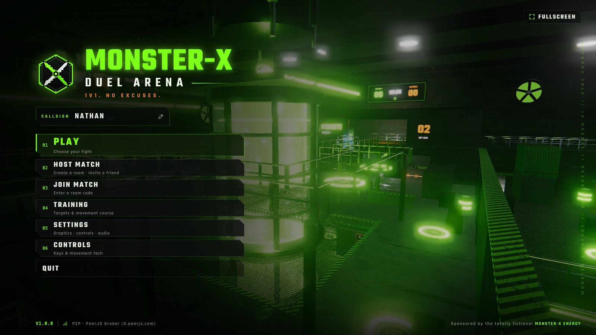
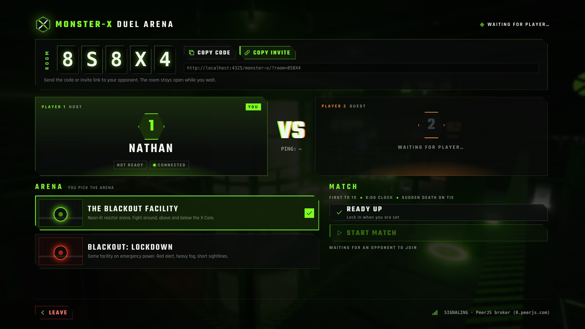
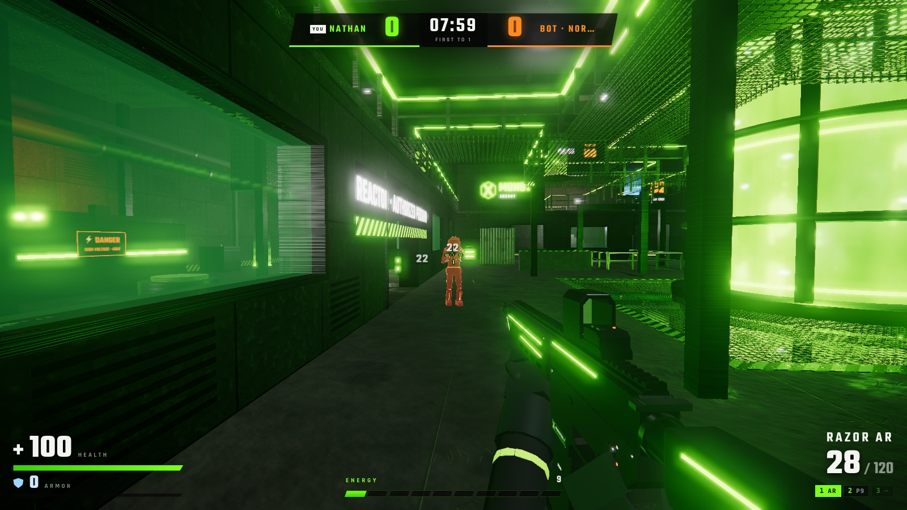
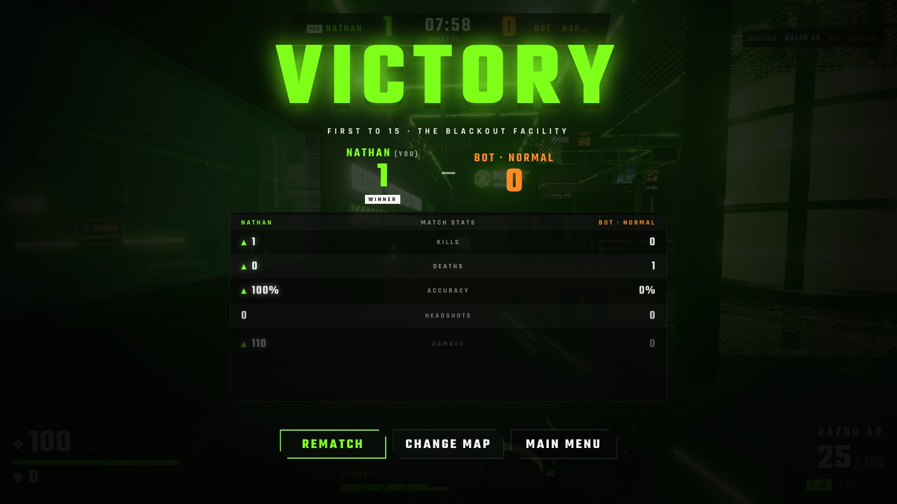

# MONSTER-X: DUEL ARENA

**1V1. NO EXCUSES.**

A fast, browser-based, online **1v1 first-person arena shooter**. Host a private room, send your friend a 5-letter code or an invite link, and fight in **THE BLACKOUT FACILITY**: an abandoned underground extreme-sports research facility built around a glowing X-Core energy reactor.

No downloads and no installs. Both players open the same URL in a desktop browser. Gameplay runs **peer-to-peer over WebRTC DataChannels**, with the host's browser acting as the authoritative server.

> MONSTER-X ENERGY is a **fictional** sponsor made for this game. It is not affiliated with, and does not use any branding of, Monster Energy.






---

## Contents

- [Features](#features)
- [Controls](#controls)
- [How to play](#how-to-play)
- [Host a match / join a friend](#host-a-match--join-a-friend)
- [Local installation and development](#local-installation-and-development)
- [Deploying to GitHub Pages](#deploying-to-github-pages)
- [Signaling: zero-config PeerJS or Firebase](#signaling-zero-config-peerjs-or-firebase)
- [Environment variables](#environment-variables)
- [Testing](#testing)
- [Troubleshooting](#troubleshooting)
- [Browser compatibility](#browser-compatibility)
- [Architecture](#architecture)
- [Project structure](#project-structure)

---

## Features

**Online multiplayer (real, not simulated)**
- HOST MATCH generates a room code from an unambiguous alphabet (no `O 0 I 1`), using `crypto.getRandomValues`.
- JOIN MATCH by code, or open an invite link (`…/?room=7FK2P`) to land on a pre-filled join screen. The lobby has COPY CODE and COPY INVITE buttons.
- WebRTC DataChannels: a **reliable, ordered** channel for match events and an **unordered, zero-retransmit** channel for 30 Hz binary player snapshots (stale movement packets are never resent).
- **Host-authoritative** rules. The host decides health, armor, damage, kills, respawns, pickups, rockets, destructibles, the timer and the winner. The guest only sends actions (fire, reload, interact, Energy Rush). The host validates fire rate, ammo, shot origin, pickup distance, Energy, movement speed and teleports.
- **Lag compensation.** The host rewinds its own position history (clamped to 500 ms) to the moment the guest was looking at, then raycasts.
- **Snapshot interpolation** with an adaptive ~85 ms buffer, short extrapolation and teleport snapping, so remote players move smoothly on irregular packets. Your own movement and shots are **predicted locally** and respond on the very next frame.
- Clock synchronization, sequence numbers with packet-loss tracking, a live ping indicator (green 0–60 ms, yellow 61–120 ms, red 121+), and an **F3** network debug panel.
- **Disconnect handling.** The match clock pauses and you see OPPONENT DISCONNECTED / RECONNECTING… with a 15-second window. A dropped guest (even after a page reload) rejoins and the match resumes. Otherwise it reports MATCH ENDED — OPPONENT LEFT.
- REMATCH reuses the same room (both players vote); CHANGE MAP returns both players to the lobby.

**Gameplay**
- Rules: first to 15 eliminations, 8:00 clock, most kills at time-out, **SUDDEN DEATH** on a tie. 2 s respawn, safe spawn selection (distance + line-of-sight checks), and 1 s spawn protection that ends when you fire.
- Movement: walk 5 / run 7 / sprint 9 m/s, a 1.2 m jump, an 11 m/s slide burst, slide-jumps, quake-style air strafing, mantling, wall kicks, jump pads and rocket jumps. Coyote time and jump buffering keep it responsive.
- Seven weapons: RAZOR AR, VOLT SMG, CRUSH SHOTGUN (10 pellets, knockback, shell-by-shell reload), VENOM DMR (1.8× headshots), CHAOS LAUNCHER (networked rockets, splash, rocket jumps), ENERGY RAIL (90 body, instant elimination headshot), and the STING P9 sidearm. Plus a quick melee.
- Health 100, armor 50 (armor absorbs first), +20/+50 health, +25 armor, and **Mega Energy** (overheal to 150, decaying back to 100).
- **Energy meter**, filled by damage, eliminations, energy cans and movement tricks. At 100, **F** triggers ENERGY RUSH for 8 s: +15% speed and reload speed, higher jumps, a green trail, an edge glow and a heartbeat. It deliberately adds no damage bonus.
- Destruction: exploding energy barrels (chain reactions), breakable windows, shootable lamps and sparking electrical boxes.
- Announcer: FIRST BLOOD, DOUBLE DOWN, DOMINATING, REVENGE, ENERGY RUSH READY, MATCH POINT, SUDDEN DEATH, VICTORY / DEFEAT.
- **Practice vs bot** at Easy / Normal / Hard / Insane. The bot uses an auto-generated navigation graph and takes jump pads, mantles and drops. It picks weapons by range, collects items, strafes, retreats to health when hurt and pushes when you are weak.
- **Training Grounds**: stationary, moving and strafing targets, weapon racks with every gun, a movement course, damage numbers and a live accuracy/DPS tracker.

**Presentation**
- Three.js PBR rendering: procedurally generated albedo, normal and packed AO/roughness/metalness maps; an environment map captured from the arena itself; shadow maps; bloom; ACES tone mapping; exponential fog; volumetric-style light shafts; and optional GTAO and camera motion blur.
- The reactor has an animated energy shader, glass, electrical arcs, rising particles and rotating rings. Around it: holographic ads, live digital scoreboards, fans, a moving gantry crane, steam vents and flickering lights.
- Procedural characters (motocross / BMX / tactical gear, green vs orange accents) with procedural animation and **verlet ragdoll** deaths.
- First-person viewmodels with gloved arms, ADS sight alignment, sway, bob, recoil springs, and reload/switch/melee/pump animations.
- **All audio is synthesized** with the Web Audio API: punchy layered gunshots, surface-dependent directional footsteps (HRTF), a reactor hum, an adaptive drum & bass / industrial soundtrack, and announcer stingers plus speech synthesis.
- Every graphics, control, crosshair, camera and audio option in the spec, plus LOW / MEDIUM / HIGH / ULTRA presets (auto-detected on first launch).

---

## Controls

| Action | Default |
| --- | --- |
| Move | `W` `A` `S` `D` |
| Aim / fire | Mouse / Left click |
| Aim down sights | Right click |
| Jump · mantle (hold into a ledge) · wall kick (in air next to a wall) | `Space` |
| Sprint | `Shift` |
| Crouch / slide (crouch while sprinting) | `C` or `Ctrl` |
| Reload | `R` |
| Interact / pick up (swap weapons, vending machines…) | `E` |
| Primary / secondary / special weapon | `1` `2` `3` (mouse wheel cycles) |
| Quick melee | `Q` |
| Energy Rush | `F` |
| Scoreboard | `Tab` (hold) |
| Pause / release mouse | `Esc` |
| Network debug panel | `F3` |

Every action is rebindable: open **CONTROLS** from the main menu (or **Settings → Controls**), click a key, and press the new key or mouse button. `Esc` cancels, `Backspace` clears a slot, and **RESET TO DEFAULTS** restores everything. Bindings are saved in the browser, and in-game prompts show your keys. Browsers reserve some shortcuts (e.g. `Ctrl+W` closes the tab), so **`C` is the safer crouch key**. In fullscreen on Chrome/Edge, the game uses the Keyboard Lock API so `Ctrl`, `W` and `Tab` reach the game; hold `Esc` to leave fullscreen.

---

## How to play

1. Open the site in a desktop browser and set your **CALLSIGN** on the main menu.
2. Pick a mode from **PLAY**: Online Duel (host or join), Practice vs Bot, or Training.
3. Click into the game to lock the mouse. `Esc` releases it and opens the pause menu.
4. Win by reaching **15 eliminations** first, or by leading when the 8-minute clock runs out. A tie goes to sudden death.

Tips: rare weapons (Chaos Launcher in the core chamber under the reactor, Energy Rail on the south sniper platform) respawn on fixed timers. Mega Energy sits on top of the reactor; take the jump pads on the north side of the atrium to reach it. Listen for footsteps: they're directional and sound different on metal, grates, gravel and concrete.

---

## Host a match / join a friend

**Player 1 (host):** click **HOST MATCH**. You'll see a room code like `M7K4Q`. Click **COPY INVITE** (or **COPY CODE**) and send it to your friend.

**Player 2:** open the same website and click **JOIN MATCH**, type the code, then **JOIN**. If you got an invite link, just open it: the join screen opens with the room pre-filled.

Once connected, both players see the lobby with names, READY status and live ping. Both click **READY UP**, the host picks the arena and clicks **START MATCH**. After the flyover and `3 · 2 · 1 · FIGHT`, the duel is on.

After the match, both players can click **REMATCH** (same room, no new code) or **CHANGE MAP** (back to the lobby).

---

## Local installation and development

Requirements: Node.js 20+ (22 recommended) and npm.

```bash
npm install
```

```bash
npm run dev
```

Vite prints a local URL (default `http://localhost:5173`). To play against yourself locally, open it in two browser windows: host in one, join in the other.

```bash
npm run build
```

`npm run build` writes a static production build to `dist/`. `npm run preview` serves that build locally.

Optional: run your own signaling broker instead of the public one:

```bash
npm run signal
```

Then open `http://localhost:5173/?signal=localhost` in both windows (invite links carry the parameter automatically).

No `.env` is required. With no configuration, the game uses the public PeerJS broker for matchmaking and public STUN servers for NAT traversal.

---

## Deploying to GitHub Pages

The repository includes `.github/workflows/deploy.yml`, which builds and deploys on every push to `main`.

1. Create a GitHub repository and push this project to its `main` branch.
2. In the repository, go to **Settings → Pages → Build and deployment → Source** and choose **GitHub Actions**.
3. Push to `main` (or run the workflow manually from the **Actions** tab).
4. Open `https://<USERNAME>.github.io/<REPO>/` and send that URL to your friend.

The Vite base path is **relative (`./`)**, so the build works from any GitHub Pages sub-directory without configuring the repository name, and `?room=` invite links keep working. Set the `VITE_BASE` repository variable only if you need an absolute base.

To configure Firebase, TURN, or a self-hosted broker for the deployed site, add the `VITE_*` values from `.env.example` under **Settings → Secrets and variables → Actions** (as variables or secrets). The workflow passes them to the build.

---

## Signaling: zero-config PeerJS or Firebase

WebRTC needs a signaling channel to exchange the room handshake, SDP offer/answer and ICE candidates. **Only** that goes through signaling. All gameplay traffic flows directly between the two browsers.

### Default: PeerJS broker (zero configuration)

With nothing configured, the game uses the free public broker at `0.peerjs.com`. The host registers the peer id `mxduel-v3-<CODE>`, and the joiner knocks on that id. If nobody answers, the join screen reports **ROOM NOT FOUND**. Rooms live exactly as long as the host's tab is open, so nothing is stored.

You can self-host the broker (`npx peer --port 9000`) and point the game at it with `VITE_PEERJS_HOST` (build time) or `?signal=host&signalPort=port` (runtime).

### Optional: Firebase Realtime Database

Set the `VITE_FIREBASE_*` variables and the game switches to Firebase signaling automatically (`VITE_SIGNALING=peerjs` forces PeerJS). Firebase is loaded lazily, so it never adds to the download when unused.

What it stores, only under `rooms/<CODE>`: room metadata (`hostUid`, `createdAt`, `expiresAt`, `status`), the guest's claim, and two short-lived message inboxes for SDP/ICE. Messages are deleted as soon as they are read.

- **Security:** anonymous authentication plus the rules in [`firebase/database.rules.json`](firebase/database.rules.json). Everything is denied by default. Only the host can write its room, only the claimed guest can post to the host's inbox, and only the host can read it.
- **Cleanup:** the host's connection registers `onDisconnect().remove()`, so abandoned rooms vanish. Every room has a 60-minute `expiresAt` (refreshed while active), and any client may delete expired rooms; the game opportunistically sweeps them when hosting. Room data is also removed when the host leaves.
- **Is the API key secret?** No. The Firebase web config is public by design; access control comes from the security rules and auth. Never put admin/service-account credentials in `VITE_*` variables.

Step-by-step console setup is in [`firebase/README.md`](firebase/README.md).

---

## Environment variables

All variables are optional and all are **build-time and public** (Vite inlines them into the bundle). See [`.env.example`](.env.example) for the annotated template; copy it to `.env.local` for local builds.

| Variable | Purpose |
| --- | --- |
| `VITE_BASE` | Public base path (default `./`). |
| `VITE_SIGNALING` | `peerjs` forces PeerJS even if Firebase is configured. |
| `VITE_FIREBASE_API_KEY`, `VITE_FIREBASE_AUTH_DOMAIN`, `VITE_FIREBASE_DATABASE_URL`, `VITE_FIREBASE_PROJECT_ID`, `VITE_FIREBASE_APP_ID` | Firebase web config for Realtime Database signaling. |
| `VITE_TURN_URLS`, `VITE_TURN_USERNAME`, `VITE_TURN_CREDENTIAL` | TURN relay for strict NATs (comma-separated URLs). Use a usage-capped account. |
| `VITE_PEERJS_HOST`, `VITE_PEERJS_PORT`, `VITE_PEERJS_PATH`, `VITE_PEERJS_KEY`, `VITE_PEERJS_SECURE` | Self-hosted PeerJS broker. |

Runtime URL overrides (handy for testing; invite links preserve them): `?signal=` / `?signalPort=` / `?signalInsecure`, `?signaling=peerjs`, `?turn=turn:host:3478&turnUser=…&turnPass=…` (add `&relay=1` to force relayed traffic), and `?netdebug` (verbose connection logging).

---

## Testing

The end-to-end test drives **two separate Chrome instances** through the full online flow. It runs against the production build, served from a GitHub-Pages-style sub-directory (`/monster-x/`), with a local signaling broker.

```bash
npm run build
```

```bash
npm run test:e2e
```

It checks: main menu → HOST MATCH → room code → invite link → JOIN → WebRTC connected → both READY → START → intro + countdown → FIGHT. Then it checks that movement replicates both ways (and positions agree), that each player damages the other (both sides agree on health), and that eliminations, score and respawns work. It plays until a player reaches **15**, then checks VICTORY on one screen and DEFEAT on the other, the stats screens, a two-vote REMATCH in the same room, and that there were no page errors. Screenshots land in `tests/screenshots/`.

Options: `--public` uses the real public PeerJS broker, `--headful` shows the windows, `--kills=N` shortens the match, and `--turn` relays media through a local TURN server. Use `--turn` when a VPN (e.g. Cloudflare WARP) blocks same-machine UDP; its relay drops connections periodically, which also exercises the reconnect path. The test uses your installed Chrome (`CHROME_PATH` overrides the location).

Other suites (run `npm run build` first): `npm run test:solo` (bot match, training and graphics presets), `npm run test:reconnect` (drop and resume a connection), and `npm run test:rebind` (rebind keys from the menus and use them in a match).

---

## Troubleshooting

**"ROOM NOT FOUND"**: check the code. The host must keep their tab open, since rooms exist only while the host is in the lobby or match.

**Stuck on "CONNECTING…" / "COULD NOT CONNECT TO HOST (FIREWALL/NAT)"**: the browsers found each other but couldn't open a direct path. Most home networks work with STUN, but corporate, campus, CGNAT/mobile networks and some VPNs need a **TURN relay**. Configure `VITE_TURN_URLS` (Cloudflare Calls TURN, Metered, Twilio or your own coturn) and redeploy. Disabling a VPN on one side often helps too.

**"CAN'T REACH MATCHMAKING"**: the signaling server is unreachable. Check your connection, try again in a moment (the public PeerJS broker is a free shared service), or self-host a broker / configure Firebase.

**Low FPS**: Settings → Graphics → **LOW** or **MEDIUM**, or lower the Resolution (render scale). Make sure hardware acceleration is enabled in the browser. Laptops: plug in and use the high-performance GPU.

**Mouse doesn't turn the camera**: click the game to lock the pointer. If you see CLICK TO RESUME, the lock was released (Esc, alt-tab or a browser prompt).

**Ctrl closes the tab**: use `C` to crouch, or play in fullscreen on Chrome/Edge (Keyboard Lock).

**No sound**: browsers start audio only after a click or keypress; click anywhere. Check the volume sliders in Settings → Audio.

**The match pauses with "OPPONENT DISCONNECTED"**: one side's network dropped. The game retries for 15 seconds and resumes automatically. A guest who reloads the page can rejoin the same room from the invite link.

---

## Browser compatibility

| Browser | Status |
| --- | --- |
| Google Chrome (current) | Primary target; full support including Keyboard Lock and raw mouse input. |
| Microsoft Edge (current) | Full support. |
| Firefox (current) | Supported. |
| Safari 17+ (macOS) | Supported (WebGL2 + WebRTC DataChannels). |

Requires WebGL2, WebRTC DataChannels and Web Audio. Desktop keyboard + mouse; touch devices are not supported.

---

## Architecture

```
            ┌──────────── signaling (handshake only) ─────────────┐
            │   PeerJS broker  ─or─  Firebase RTDB (rooms/<CODE>) │
            └───────────────▲─────────────────────▲───────────────┘
                            │ SDP / ICE            │
   ┌────────────────────────┴───┐          ┌───────┴────────────────────┐
   │ HOST (Player 1)            │  WebRTC  │ GUEST (Player 2)           │
   │ HostAuthority: rules,      │◄════════►│ predicted movement + shots │
   │ damage, lag compensation,  │ reliable │ sends actions (fire, …)    │
   │ pickups, timer, winner     │ + fast   │ applies host events        │
   │ MatchClient (local player) │ channels │ MatchClient (local player) │
   └────────────────────────────┘          └────────────────────────────┘
```

- **Events, one code path:** the authority emits compact events (`dmg`, `kill`, `spawn`, `pick`, `rocket`, `boom`, …). The host applies them locally through the same `handleEvent()` the guest uses for events received over the network.
- **Snapshots:** 52-byte binary packets (position, velocity, yaw/pitch, collider height, state flags, weapon, life counter) at 30 Hz on the unreliable channel. Snapshots are timestamped in host clock time.
- **Validation:** `ShotValidator` (token-bucket fire rate and magazine accounting), shot-origin distance checks, pickup and interact distance checks, Energy budget limits for movement tricks, and teleport rejection.
- **Assets:** the game ships no binary assets. Weapons, characters and the arena are procedural Three.js geometry. Textures are generated on canvas at load time (resolution follows the texture-quality setting), and all sound is synthesized. The whole game is about 365 KB of gzipped JavaScript (game + three.js); the Firebase chunk is only downloaded when Firebase signaling is configured.

---

## Project structure

```
index.html                  Shell: canvas + UI root, fonts
vite.config.js              Relative base, chunking (three / lazy firebase)
.github/workflows/deploy.yml GitHub Pages CI
firebase/                   Realtime Database rules + setup guide
public/                     icons/ (favicon); models/, textures/, audio/ notes
tests/e2e-duel.mjs          Two-browser online duel test
tests/e2e-*.mjs             Solo, reconnect and key-rebinding tests
src/
  main.js                   Boot (WebGL2 check)
  game.js                   Renderer, loop, app state machine, menu/lobby/match flows
  matchClient.js            In-match logic for this machine (input, prediction, events, HUD state)
  match.js                  HostAuthority: rules, damage, lag compensation, pickups, timer
  network.js                NetSession: host/join, link lifecycle, ping/clock, reconnection
  network/webrtc.js         RTCPeerConnection + reliable/fast DataChannels
  network/rooms.js          Room codes, invite links, signaling backend selection
  network/signaling-peerjs.js   Zero-config PeerJS broker client
  network/signaling-firebase.js Firebase RTDB signaling (optional)
  network/sync.js           Binary snapshots, interpolation buffer, clock sync, loss tracking
  player.js                 Movement simulation (slides, air strafe, mantle, wall kick, pads)
  physics.js                Collision world (boxes, cylinders, ramps), raycasts, hitboxes
  weapons.js                Weapon controller, deterministic spread, shot validation
  weapons/*.js              Weapon stats + procedural models (AR, SMG, shotgun, DMR, launcher, rail, pistol)
  arena.js / arenaBuilder.js  THE BLACKOUT FACILITY (+ LOCKDOWN variant) and geometry batching
  training.js               Training Grounds
  pickups.js                Pickup definitions + visuals
  bot.js / nav.js           Practice bot + automatic navigation graph
  characters.js             Procedural player models, animation, verlet ragdoll
  viewmodel.js              First-person weapon + arms
  effects.js                Pooled VFX (sparks, smoke, tracers, rail beams, decals, casings, explosions)
  postfx.js                 Bloom, AO, motion blur, combat overlay, tone mapping, SMAA/FXAA
  textures.js               Procedural PBR textures + materials
  audio.js                  Synthesized SFX, adaptive music, announcer
  input.js / settings.js    Rebindable input, pointer lock, persistent settings + presets
  ui.js, ui/*.js            Menus, lobby, settings, HUD, scoreboard, end screen
  styles/*.css              Design tokens, menus, HUD
```

---

Built with [Three.js](https://threejs.org) and [Vite](https://vitejs.dev). Default signaling via [PeerJS](https://peerjs.com).
